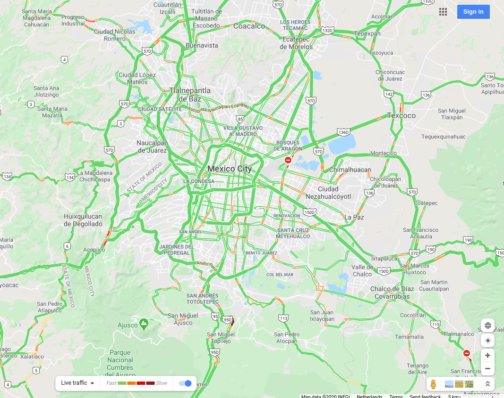
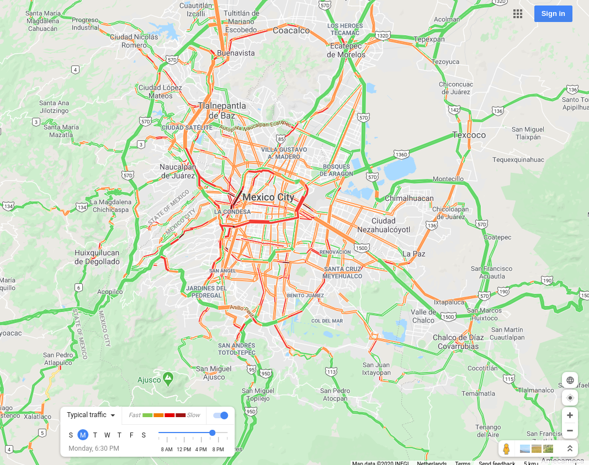
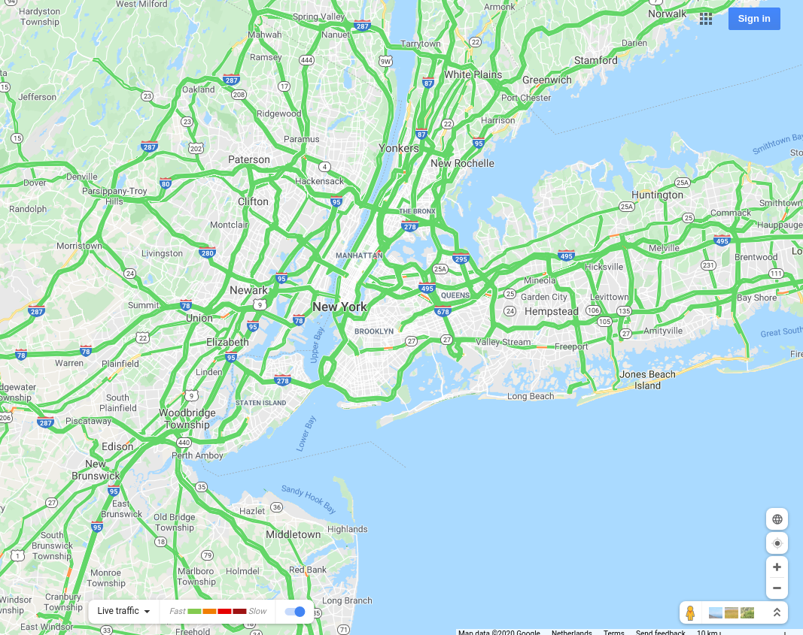
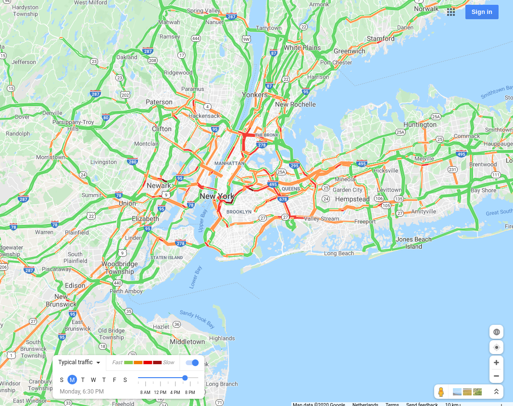

# Visual effect of COVID-19 on city traffic maps

## As of March 2020

The [COVID-19 outbreak](https://en.wikipedia.org/wiki/Coronavirus_disease_2019) has had a significant impact on daily life. Owing to the highly contagious nature of the virus, various governments around the world have imposed "lockdowns" to prevent its spread, and consequently employees have been forced to work from home as far as possible.

This has had an interesting effect on commuting patterns, since cities notorious for traffic jams are now seeing near-empty streets at otherwise peak hours. Naturally, it'd be interesting to view this change visually!

This code does precisely that - it enables the "traffic" mode on Google Maps, views the maps of various cities and takes screenshots comparing "Live traffic" with "Typical traffic". The results look quite interesting, and moreover the list of cities can be customized!

Here's a couple samples showing how different the situation looks:

### Mexico city

During COVID-19            |  Peak traffic, typically
:-------------------------:|:-------------------------:
  |  

### New York city

During COVID-19            |  Peak traffic, typically
:-------------------------:|:-------------------------:
  |  

## Prerequisites, caveats

Google Chrome (80.*) needs to be installed on your system.

The following Python packages are used:
- [Selenium Python bindings](https://selenium-python.readthedocs.io/installation.html)
- [Pillow](https://python-pillow.org/)

If you're using conda for Python environment management, the exported environment for this code can be found in `environment.yml`.

One main point to note here is that this code makes a whole lot of assumptions, especially with regards to the user interface provided by Google Maps at the time of writing this. The [Google Maps API](https://cloud.google.com/maps-platform/) would definitely be a lot better at this, but I wanted to try out browser automation using Selenium; it was more of a personal thing, and just a rapid implementation of a random idea. It's also the reason why it's written only for Google Chrome.

Though the code is not very robust, it works.

## Usage

- Clone this repository using `git clone`
- Install the necessary Python3 packages:
  - either via [PIP](https://pypi.org/project/pip/)
  - or using [Conda](https://docs.conda.io/en/latest/), in which case the `environment.yml` file can be used for creating the necessary environment
- Run the main script file as:
  - `python3 main_script.py`, in which case a default list of cities will be used
  - `python3 main_script.py <city-list>.txt`, by providing a .txt file with a comma- or newline-separated list of cities you'd like to compare
- Let the browser automation magic happen
- If you want cropped city maps instead of complete screenshots, run `python3 img_cropper.py` - this will create another directory with the cropped images
